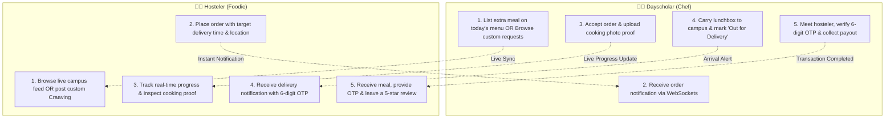

# 🍱 Craavyo — Campus Peer-to-Peer Food Sharing Platform

> **Craavyo** connects college **Hostelers** craaving authentic, hygienic home-cooked meals with **Dayscholars** who bring fresh food prepared by their families. Say goodbye to monotonous hostel mess food and enjoy the comfort of *maa ke haath ka khana* right on your campus.

---

## 🌟 What is Craavyo? (The Vision & Explanation)

### 🚩 The Problem
For millions of college students living in hostels and PGs across India:
- **Mess Food Fatigue**: Hostel mess menus are repetitive, bland, and often lack essential nutrition and the warmth of real home cooking.
- **Expensive Commercial Delivery**: Ordering daily from commercial food delivery platforms (Swiggy/Zomato) is financially unsustainable for students on a budget and often unhealthy.
- **Untapped Home Food**: On the same campus, thousands of day-scholars commute daily with fresh, delicious, mother-cooked meals. Many families would gladly cook an extra portion, but there has never been a structured, secure platform to connect them.

### 💡 The Craavyo Solution
**Craavyo** creates a hyper-local, peer-to-peer campus food marketplace:
- **For Hostelers**: Get authentic, hot, home-cooked meals (dal-chawal, parathas, biryani, regional specials) delivered directly on campus at student-friendly prices (₹40 – ₹120).
- **For Dayscholars**: Earn steady pocket money and build culinary reputation simply by carrying an extra tiffin box packed by their family.
- **For Campus Communities**: Fosters genuine bonds, breaks inter-batch barriers, and creates a culture of sharing and care across the student body.

---

## 👥 How Craavyo Works (Step-by-Step)



### 🧑‍🎓 The Hosteler Experience
1. **Campus Onboarding**: Select your college campus and verify your mobile number via OTP.
2. **Browse or Request**:
   - **Browse Live Menu**: Explore fresh home-cooked dishes listed today by day-scholars in your college, categorized by dietary preference (*Pure Veg, Non-Veg, Bestseller, Spicy*).
   - **Post a Custom Craaving**: Missing a specific home dish (e.g., *Rajma Chawal* or *Aloo Paratha*)? Post a custom request specifying description, budget, and needed-by time.
3. **Live 4-Step Tracking**: Follow your meal's real-time progress (*Accepted ➔ Preparing ➔ Out for Delivery ➔ Delivered*) with live ETA.
4. **Authenticity Proof**: View photo proofs uploaded by the chef while cooking to ensure hygiene and authenticity.
5. **Secure Handshake Delivery**: Meet your peer at the designated campus spot, provide your unique 6-digit OTP to complete handoff, and rate the meal with feedback.

### 👩‍🍳 The Dayscholar Experience
1. **Publish Dishes**: Post today’s available meals in seconds with dish title, description, price, portion count, and photo.
2. **Accept Live Orders & Custom Requests**: Receive instant audio/visual notifications when hostelers order or post custom requests.
3. **Photo Proof Uploads**: Snap a quick photo while the meal is packed/prepared to build trust and earn verified-chef badges.
4. **Campus Delivery**: Hand over the tiffin box to the hosteler on campus and enter their 6-digit delivery OTP to securely conclude the order.
5. **Earnings & Reputation Dashboard**: Track daily/monthly earnings, manage active menus, and view reviews left by hostelers.

---

## ✨ Core Features & Platform Highlights

| Feature | Description |
| :--- | :--- |
| **🎨 Dual Tailored Dashboards** | Role-specific theme palettes: Rich brick-red for Hostelers and warm-gold for Dayscholars. |
| **⚡ WebSocket Real-Time Sync** | Zero page reloads. Order progress, new menu items, and custom requests propagate instantly across connected users. |
| **🔐 Campus & Phone Verification** | Secure student onboarding with mobile OTP verification (Twilio / 2Factor / Console fallback) tied to specific college campuses. |
| **📍 Multi-Order Live Tracking** | Interactive 4-step stepper with animated progress bar, cooking proofs, dynamic ETA, and 6-digit delivery OTP. |
| **📸 Cloudinary Proof Uploads** | Day-scholars can upload live cooking and packaging proofs to maintain high hygiene standards. |
| **⭐ Ratings & Reviews System** | Community-driven reputation system with 5-star ratings, feedback tags, and reviews to highlight top campus chefs. |
| **🔄 Seamless Reordering** | One-click reordering from past order history for your favorite recurring meals. |
| **⏳ Granular Loading States** | Built-in spinners (`FiLoader`) and disabled button states prevent double-submissions and provide clear visual feedback. |

---

## 🛠️ Technology Stack

### Frontend Client
- **Core**: [React.js](https://react.dev/) with [Vite](https://vitejs.dev/)
- **Styling**: [Tailwind CSS v4](https://tailwindcss.com/) with tailored HSL color tokens
- **Animations**: [Framer Motion](https://www.framer.com/motion/)
- **Icons**: [React Icons](https://react-icons.github.io/react-icons/) (`react-icons/fi`, `react-icons/fa`, `react-icons/io5`)
- **Real-Time Client**: [Socket.io Client](https://socket.io/docs/v4/client-api/)
- **HTTP Client**: [Axios](https://axios-http.com/)
- **Notifications**: [React Hot Toast](https://react-hot-toast.com/)

### Backend API Server
- **Runtime**: [Node.js](https://nodejs.org/) & [Express.js](https://expressjs.com/)
- **Database**: [MongoDB](https://www.mongodb.com/) via [Mongoose ODM](https://mongoosejs.com/)
- **Authentication**: JWT (JSON Web Tokens) & Firebase Admin SDK (Google OAuth)
- **WebSockets**: [Socket.io](https://socket.io/) (Room-based message channels)
- **SMS & OTP Engine**: Twilio & 2Factor API integration with development fallback
- **Cloud Storage**: [Cloudinary](https://cloudinary.com/) (Direct unsigned & signed media uploads)

---

## 📁 Repository Structure

```text
Homeal/
├── backend/
│   ├── config/
│   │   ├── db.js                     # MongoDB connection handler
│   │   └── firebase.js               # Firebase Admin SDK initialization
│   ├── controllers/
│   │   ├── authController.js         # Register, Login, Google OAuth, Profile
│   │   ├── mealController.js         # Menu creation, updates, listing & deletion
│   │   ├── orderController.js        # Order state pipeline & OTP verification
│   │   ├── foodRequestController.js  # Custom craaving request lifecycle
│   │   ├── reviewController.js       # Star ratings & peer feedback comments
│   │   └── otpController.js          # SMS OTP dispatch & verification
│   ├── middleware/
│   │   └── authMiddleware.js         # JWT validation & user attachment
│   ├── models/
│   │   ├── User.js                   # Student profile, role, phone, campus
│   │   ├── Meal.js                   # Dishes, pricing, categories, photos
│   │   ├── Order.js                  # Order state, OTP, cooking proof, prices
│   │   ├── FoodRequest.js            # Custom craaving request model
│   │   └── Review.js                 # 5-star ratings & text reviews
│   ├── routes/                       # Express API route modules
│   ├── utils/
│   │   └── sendSmsService.js         # Multi-provider SMS dispatcher
│   └── server.js                     # Server bootstrap & Socket.io logic
│
└── frontend/
    ├── public/                       # Static branding, thali assets, illustrations
    ├── src/
    │   ├── assets/                   # Image assets and illustrations
    │   ├── components/
    │   │   ├── CollegeOnboardingModal.jsx  # Campus selector & SMS OTP flow
    │   │   ├── RequestFoodModal.jsx        # Custom craaving submission modal
    │   │   └── ReviewModal.jsx             # Post-meal rating popup
    │   ├── context/
    │   │   ├── AuthContext.jsx       # Global user session & token state
    │   │   └── SocketContext.jsx     # Global Socket.io real-time connection
    │   ├── pages/
    │   │   ├── Home.jsx              # Landing page (Hero, Steps, Stories, Footer)
    │   │   ├── Login.jsx             # Student login screen
    │   │   ├── Register.jsx          # New student registration screen
    │   │   ├── SelectRole.jsx        # First-time role onboarding
    │   │   ├── AllMeals.jsx          # Full campus meal catalog & search
    │   │   ├── TrackOrders.jsx       # Multi-order live tracking feed
    │   │   └── Dashboard/
    │   │       ├── HostelerDashboard.jsx   # Buyer hub, live menu, active trackers
    │   │       └── DayscholarDashboard.jsx # Chef hub, menu manager, orders pipeline
    │   ├── services/
    │   │   └── api.js                # Axios instance with auth interceptors
    │   ├── index.css                 # Custom font imports & Tailwind utilities
    │   └── main.jsx                  # React application entry point
    └── package.json
```

---

## 📡 API Endpoints Overview

| Method | Endpoint | Description | Access |
| :--- | :--- | :--- | :---: |
| **POST** | `/api/auth/register` | Register new user account | Public |
| **POST** | `/api/auth/login` | Log in user and receive JWT | Public |
| **POST** | `/api/auth/google` | Google OAuth token exchange & role assignment | Public |
| **GET** | `/api/auth/profile` | Fetch authenticated user profile | Private |
| **POST** | `/api/otp/send-otp` | Dispatch 6-digit SMS OTP | Public |
| **POST** | `/api/otp/verify-otp` | Verify SMS OTP code | Public |
| **GET** | `/api/meals` | List active campus dishes | Public |
| **POST** | `/api/meals` | Publish a new home-cooked dish | Dayscholar |
| **PUT / DELETE** | `/api/meals/:id` | Edit or delete a dish listing | Dayscholar |
| **POST** | `/api/orders` | Place a meal order | Hosteler |
| **GET** | `/api/orders/my-orders` | Fetch active and past orders | Private |
| **PATCH** | `/api/orders/:id/status`| Advance order lifecycle state & attach proof | Private |
| **POST** | `/api/orders/:id/verify-otp` | Validate delivery OTP upon food handoff | Dayscholar |
| **GET / POST** | `/api/food-requests` | View feed of custom craavings or post a new request | Private |
| **POST** | `/api/reviews` | Submit a 5-star rating & review | Hosteler |

---

## ⚙️ Environment Configuration

### Backend (`backend/.env`)
```env
PORT=5001
MONGO_URI=mongodb+srv://<username>:<password>@cluster.mongodb.net/craavyo?retryWrites=true&w=majority
JWT_SECRET=your_super_secret_jwt_key

# SMS OTP Provider (Optional for live SMS; fallback prints to console)
TWILIO_ACCOUNT_SID=your_twilio_sid
TWILIO_AUTH_TOKEN=your_twilio_token
TWILIO_PHONE_NUMBER=+1234567890

# Cloudinary (Optional server-side uploads)
CLOUDINARY_CLOUD_NAME=your_cloud_name
CLOUDINARY_API_KEY=your_api_key
CLOUDINARY_API_SECRET=your_api_secret
```

### Frontend (`frontend/.env`)
```env
VITE_API_URL=http://localhost:5001/api
VITE_SOCKET_URL=http://localhost:5001
VITE_CLOUDINARY_UPLOAD_PRESET=your_unsigned_preset
VITE_CLOUDINARY_CLOUD_NAME=your_cloud_name
```

---

## 🚀 Getting Started & Local Setup

### Prerequisites
- [Node.js](https://nodejs.org/) (v18+ recommended)
- [MongoDB](https://www.mongodb.com/) (Local server or MongoDB Atlas connection string)
- Git

### 1. Clone the repository
```bash
git clone https://github.com/hrishob0108/Homeal.git
cd Homeal
```

### 2. Backend Setup
```bash
cd backend
npm install
# Ensure .env is populated with your MongoDB URI
npm start
```
*Backend API server runs at `http://localhost:5001`.*

### 3. Frontend Setup
```bash
cd ../frontend
npm install
npm run dev
```
*Frontend application launches at `http://localhost:5173`.*

---

## ⚡ Real-Time WebSocket Events

Craavyo coordinates real-time campus events through Socket.io channels:

- `join_user_room(userId)`: Joins the user to their private notification stream.
- `new_order`: Alerts the chef immediately when an order is placed.
- `order_status_updated`: Instantly transitions the hosteler's stepper (*Preparing ➔ Out for Delivery ➔ Delivered*).
- `new_food_request`: Broadcasts custom craaving requests to all active dayscholars.
- `new_dish_available`: Updates the live meal catalog in real time without refreshing.

---

## 📄 License

This project is licensed under the [MIT License](LICENSE).

---

<div align="center">
  <sub>Craavyo — Crafted with ❤️ for college students everywhere craaving the taste of home.</sub>
</div>