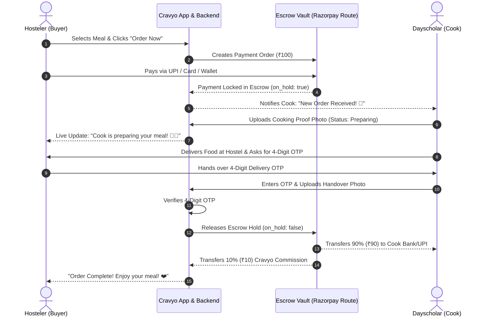

# 🛡️ Cravyo Escrow Payment System — Architecture & Implementation Spec

> **Version**: 1.0  
> **Target Audience**: Cravyo Engineering, Product, and Founding Team  
> **Status**: Proposed Specification  

---

## 📌 Executive Summary

Cravyo is a peer-to-peer (P2P) food marketplace connecting **Hostelers** (food buyers) with **Dayscholars** (home cooks) within college campuses. 

To eliminate fraud, build 100% trust between students, and automate platform revenue, Cravyo will implement an **Escrow Payment System** powered by **Razorpay Route** (India) / **Stripe Connect** (Global).

Under this model:
- Money paid by a Hosteler is **never sent directly to the cook upfront**.
- Funds are locked securely in **Cravyo's Escrow Vault**.
- Money is automatically split and released to the Dayscholar's bank account **only after dual-proof delivery and 4-digit OTP verification**.

---

## 🔄 High-Level Escrow Architecture Flow



---

## 🛠️ Step-by-Step Escrow Order Lifecycle

| Phase | Trigger Event | Order Status | Escrow Vault Action | Money Location |
| :--- | :--- | :--- | :--- | :--- |
| **1. Order Created** | Hosteler clicks "Order Now" | `Pending` | Payment session initialized | Hosteler's Account |
| **2. Payment Locked** | Hosteler completes UPI payment | `Payment_In_Escrow` | Hold transfer ID generated (`on_hold: true`) | **Cravyo Escrow Vault** |
| **3. Cooking Proof** | Dayscholar uploads kitchen photo | `Preparing` | Funds remain locked | **Cravyo Escrow Vault** |
| **4. Out for Delivery** | Dayscholar starts delivery | `Out_For_Delivery` | Funds remain locked | **Cravyo Escrow Vault** |
| **5. OTP Verification** | Dayscholar inputs 4-digit OTP | `Delivered` | Escrow Hold Released (`on_hold: false`) | **90% Cook / 10% Cravyo** |
| **6. Auto-Refund** | Cook cancels or times out (30m) | `Cancelled` | Full refund initiated to Hosteler | **Refunded to Hosteler** |

---

## 💰 Financial Breakdown & Revenue Model

### Example Order: ₹100 Home-Cooked Meal

```
Total Charged to Hosteler:  ₹100.00
--------------------------------------------------
- Payment Gateway Fee (2% + 18% GST): -₹2.36
- Dayscholar Cook Payout (90%):       -₹90.00
--------------------------------------------------
= NET CRAVYO PLATFORM PROFIT:          +₹7.64 (7.64%)
```

### Key Revenue Highlights:
- **Zero Risk**: Payment gateway fees are 100% covered by Cravyo’s platform commission.
- **Automated Payouts**: Dayscholars receive payouts directly to their bank accounts or UPI IDs without manual intervention.

---

## 🗄️ Database Schema Updates (`Order.js` & `User.js`)

### 1. `Order.js` Additions
```javascript
{
  paymentStatus: {
    type: String,
    enum: ["Pending", "In_Escrow_Hold", "Released_To_Cook", "Refunded"],
    default: "Pending"
  },
  razorpayOrderId: { type: String, default: "" },
  razorpayPaymentId: { type: String, default: "" },
  razorpayTransferId: { type: String, default: "" }, // Escrow Hold ID
  escrowHoldReleased: { type: Boolean, default: false },
  platformFee: { type: Number, default: 0 },
  cookPayoutAmount: { type: Number, default: 0 },
  otp: { type: String, required: true },
  isOtpVerified: { type: Boolean, default: false }
}
```

### 2. `User.js` Additions (Dayscholar Payout Details)
```javascript
{
  bankDetails: {
    accountNumber: { type: String, default: "" },
    ifscCode: { type: String, default: "" },
    accountHolderName: { type: String, default: "" },
    upiId: { type: String, default: "" },
    razorpayAccountId: { type: String, default: "" } // Linked Route Account
  }
}
```

---

## 🛡️ Security & Buyer Protection Rules

1. **OTP Verification Guard**:
   - Money is **NEVER** released without the Hosteler's 4-digit PIN.
   - If a cook inputs an incorrect PIN 3 times, the order is flagged for admin review.

2. **Automatic Timeout Refund**:
   - If a Dayscholar accepts an order but fails to upload a cooking proof photo within **30 minutes**, the order is auto-cancelled and **100% refunded** to the Hosteler.

3. **Dual Photo Verification**:
   - Requires 1 Cooking Proof photo (in kitchen) + 1 Handover Proof photo (at hostel door) stored in Cloudinary as immutable evidence against disputes.

---

## 🚀 Teammate Action Items & Roadmap

### 📋 Phase 1: Business KYC & Razorpay Setup (Founders)
- [ ] Register/log into [Razorpay.com](https://razorpay.com).
- [ ] Complete Business KYC (Upload Owner PAN Card, Aadhaar, & Bank Passbook).
- [ ] Navigate to **Razorpay Dashboard ➔ Route** and click **Enable Route**.
- [ ] Generate API Keys (`RAZORPAY_KEY_ID` & `RAZORPAY_KEY_SECRET`).

### 💻 Phase 2: Backend Development (Backend Lead)
- [ ] Install Razorpay SDK (`npm install razorpay`).
- [ ] Implement `POST /api/orders/create-payment-intent` to initialize Razorpay checkout.
- [ ] Implement `POST /api/orders/verify-otp-and-release-escrow` to trigger Razorpay Route hold release upon OTP match.
- [ ] Implement automated refund webhook for cancelled orders.

### 🎨 Phase 3: Frontend & Mobile UI (Frontend Lead)
- [ ] Integrate Razorpay Checkout Modal (`Razorpay.js`) on Hosteler order confirmation.
- [ ] Display **"Funds Held in Escrow"** trust badge on Hosteler checkout screen.
- [ ] Add Bank Account / UPI ID onboarding form for Dayscholars to receive instant payouts.

---

> 💡 **Summary for Team**: The Escrow system protects both students, automates our 10% platform revenue, and eliminates food fraud completely. It requires **₹0 setup cost** and can be launched in under a week!
